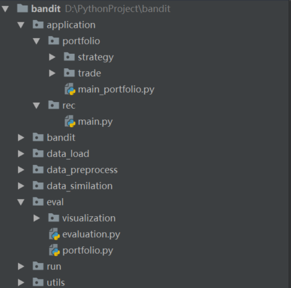

# Bandit核心库设计
----
[toc]
----
## 实验框架文件结构



文件路径|实现内容说明

-|:-:

bandit/modules| 实现modules组建，所有model应该都基于module开始构建

bandit/containers| 实现container组建，所有bandit model应该基于container开始

data_simulation/|数据集预处理，讲原始数据集生成相关特征并保存成统一格式的文件。|

eval/|主要用于计算eval指标。

# Bandit
## 1.bandit.Module (bandit.modules.module)
Module is parameter space, without bandit structure. 支持：GPU运算
### 1.1 init
初始化Initializes internal Module state.
_parameters: 参数列表，参数是每次update都会被更新的变量，Parameter的子类
_buffers: 固定变量列表，会被调用，但是不会被更新，torch.Tensor
_decide_hooks: 参与decide的变量，可以是parameter，也可以是buffer
### 1.2 update
必须实现的函数，否则会报错。
用于在每次call的时候根据result和BanditData更新参数
### 1.3 decide
取出decide_hooks中的变量
### 1.4 register
每个变量都需要被注册，已经重构赋值函数，自动注册。
但是decide_hooks需要被单独注册。
```
register_decide_hooks(name_list=list(['theta', 'A_inv', 'alpha']))
```

## 2.bandit.Container (bandit.containers.container)
Base class for all bandit modules, which is bandit structure. 每个container都是一个2层的树状结构，可嵌套。
### 2.1 init
Initializes.
_module: root module. 模型的根节点。
_submodule: submodule list. 模型的叶子节点。
### 2.2 update
必须实现的函数，否则会报错。
用于在每次call的时候决定更新哪些module。
### 2.3 decide
必须实现的函数，否则会报错。
用于在每次call的时候使用hook来的参数进行决策，最终输出结果。
### 2.4 call
执行container，输入BanditData，输出decide的return。

## 3.bandit.functional
存放所有可函数化的函数组件，增加模块的可复用性。

# utils
## 1. data_tool (utils.data)
DataLoad的工具，也可被数据预处理使用。
### 1.1 data_struct (utils.data_struct)
核心数据类：BanditData类，可开放性定制自己的数据类型，但需要写自己的构造器。其中arm_reward、arm_true_reward、arm_context、bandit_context，这四个的value必须是torch.Tensor，否则无法支持运算。
### 1.2 data_reader (utils.data_reader)
数据读取器，可fetch单条、所有、批量的数据，并且转换成BanditData类。
### 1.3 load_constructor (utils.load_constructor) 载入构造器
完成dict->BanditData的转换的构造器，可自定义。