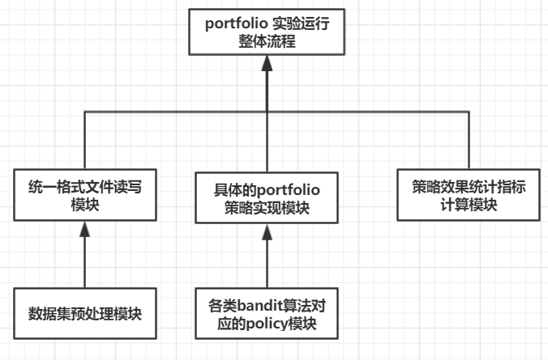
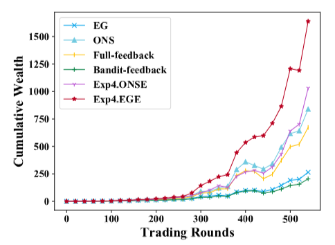
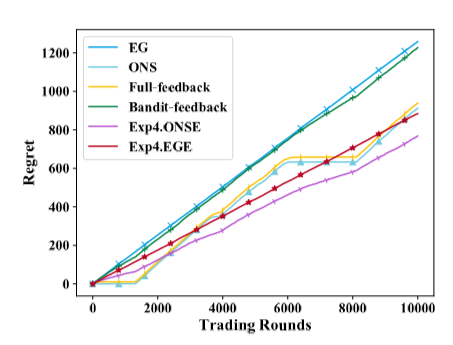
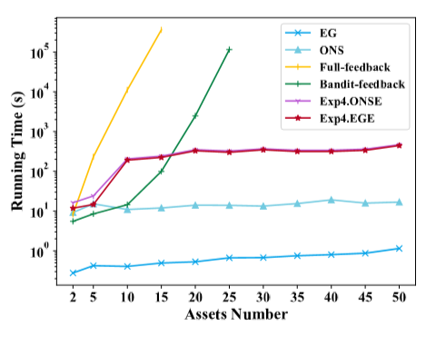
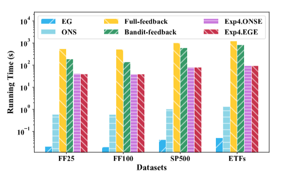

# Bandit实验框架设计——portfolio部分
----
[toc]
----
## 实验框架文件结构


文件路径|实现内容说明
-|:-:
application/|本层目录存放portfolio 实验运行整体流程，主要负责配置实验所需数据集路径、要参与对比的算法策略，并运行整个实验，统计各类指标。|
application/strategy/|存放各类portfolio算法策略，每个策略一个对象，对应一个文件。|
data_preprocess/|数据集预处理，讲原始数据集生成相关特征并保存成统一格式的文件。|
eval/|主要用于计算portfolio各类统计指标。
data_load/|负责读取已经处理好的统一格式的数据文件，支持分批读取。

## 各模块间总体的依赖关系

Portfolio部分的框架目的在于运行各类portfolio算法，并能方便进行各类算法的统计指标对比。上述5大部分功能的整体依赖关系由下图表示。




## 1. 数据集的预处理

数据预处理模块主要工作是，基于现实世界的各类数据集（FF25,FF100,ETF等）生成各类基于具体股票的特征context，以及市场环境的context，并统一转换成json格式，并通过一些压缩技术序列化后按行进行存储。每一行对应的是在一个时刻t时，各类股票的reward、股票自身的context以及市场环境的context信息。

每一行数据对应的json格式具体定义如下(data_load/ 路径下，文件命名为data_struct)：
```python
{
    timestamp: "19000101",  #时间节点，value的类型是string。
    arm_reward:{ 
        "stock1":0.22,  #每个元素均为股票的id：相对变化率，其中变化率是该股
        "stock2": -0.31,  #票相邻2个交易日价格相除再减1
        ...
        "stock25": 0.10
    }   
    arm_context:{
        "stock1": [1, 2.5, 0.555, 0.333],  #每个股票的特征维度保持一致。
        "stock1": [2, 2.5, 0.555, 0.333],
        ...
        "stock1": [1, 2.5, 1.2, 0.442]
    }
    bandit_context: [1.55, 5.66, 9.4456, 12.256,55.55]  #环境对应的特征向量
}
```
存储方式：直接将json转存为string，然后按行写入。或者在转换成string后进行一次base64编码，然后用zlib压缩后存储等。

## 2. 统一格式数据文件读写

在将原始数据集转换为统一格式后，需要实现一个读写该格式文件的模块。
该模块存放在data_load/ 路径下，负责数据读取操作。文件命名为data_load
需要实现的主要函数包括
```python
def init (file_path):  
	#初始化该读写对象，并打开对应路径的文件
def get_one():
	#返回一行数据，返回内容是一个2.1节定义过的dict对象。

def get_next_batch(batch_size = 1):
	#返回下一个batch的数据，返回内容是一个list，里面存放了batch_size行数据对应的dict对象。

def get_all():
	#直接返回该文件全部数据，返回内容是一个list，里面存放了所有dict对象。
```

## 3. portfolio 实验运行整体流程

该模块是实现portfolio实现的整体流程。负责了数据集配置，对比算法设置，训练更新算法并得到权重向量，为每个算法计算相关的评价指标等。该模块流程如下：
```python
1.	设置实验参数配置和初始化：设置数据集路径，batch_size（设为-1表示直接读取所有数据）。设置要参与实验的算法对应的list  Algorithm。
2.	for alg in Algorithm：
3.	   初始化： 初始化记录算法权重输出结果和股票reward对应的list。
4.	   weight_list = []  
5.	   reward_list = []
6.	   While true:
7.	     line = portfolio_tmplate. getNextBatch（batch_size）
8.	     If line == None:
9.	         break
10.	   	  output_weight = alg.compute_weight(line)
11.	     weight_list.append(output_weight)
12.	     reward_list.append(line[‘arm_reward’])
13.	  计算各类统计指标 eval(weight_list, reward_list)
```

## 4. portfolio具体策略实现

portfolio 具体策略，在每个时刻t都会输出一次当前投资组合策略中各个资产的权重。每个策略都互不相同，可能基于传统投资理论、也可能基于bandit模块相关算法。每个策略单独命名成一个文件，对应一个该策略的对象，存放在application/strategy/路径下
主要需要实现的函数包括
```python
def init():
#初始化该策略，主要包括初始化该对象的一些成员变量。

def compute_weight(BanditData)：
#根据输入的BanditData数据来更新权重值，返回一个dict，对应当前策略每个股票选取的权重大小，保证每个权重都是非负数，且权重之和为1。
```

## 5. portfolio 实验评估指标计算和可视化

### 5.1. 指标计算

#### 5.1.1 积累财富 Cumulative wealth

**输入**
* $w$：最终时刻各个股票权重
* $p$: 最终时刻相对价格

**计算公式**
* $CW=p^Tw$

#### 5.1.2. 夏普比率 Sharp ratio

**输入**
* $E$：回报平均值
* $R$: 无风险利率（在此可设为0）
* $\sigma$: 回报标准差
* $t$时刻回报$r_t=p_t^Tw_t$

**计算公式**
* $SR=\dfrac{E-R}{\sigma}$

#### 5.1.3. 最大回撤率 Max drawdown

>在选定周期内任一历史时点往后推，产品净值走到最低点时的收益率回撤幅度的最大值

**输入**
* $r_t$：$t$时刻回报


####  5.1.4. 波动性Volatility

**输入**
* $\sigma$：回报标准差
* $T$: 周期跨度

**计算公式**
* $Vo=\dfrac{\sigma}{T}$

### 5.2. 可视化

####  5.2.1. Cumulative Wealth可视化

* 各个算法的CW随时间变化图
* 横坐标：time
* 纵坐标：CW


#### 5.2.2. weight可视化

* 一个算法的weight随时间变化图
* 横坐标：time
* 纵坐标：不同股票weight的累加（用不同颜色表示）

#### 5.2.3. regret可视化

* 各个算法的regret随时间变化图
* 横坐标：time
* 纵坐标：regret


#### 5.2.4. runtime可视化

##### 5.2.4.1 股票数量-runtime可视化

* 各个算法的运行时间随股票数量变化图
* 横坐标：股票数量
* 纵坐标：runtime


##### 5.2.4.2. 总runtime可视化

* 各个算法的总运行时间
* 横坐标：dataset
* 纵坐标：total runtime


##### 5.2.4.3. 模块runtime可视化

* 各个算法个模块运行时间
* 横坐标：算法
* 纵坐标：不同module runtime累加（用不同颜色表示）